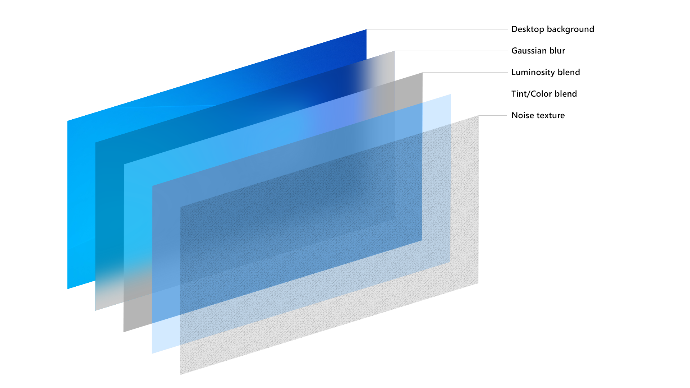

# GlassSurf

## Overview

GlassSurf is a project aimed at enhancing the visual experience of the Chrome, Firefox and Edge browser. Currently in development, this project adds a transparent effect to the main browser homepage  and ``<body>`` tags, giving it a vibrant and modern appearance.

## Features

- **Transparency Effect**: GlassSurf introduces a sleek transparent effect to the Chrome browser's main page, creating a visually appealing and modern look.
- **Customization**: Users will have the option to customize the level of transparency to suit their preferences. The project aims to provide a personalized browsing experience.

## Note

All images, including company logos and wallpapers, are used in a non-commercial manner to enhance the visual representation of the GlassSurf project. We respect intellectual property rights and aim to provide an enjoyable browsing experience for users.

## Contribute

If you want to help us, read [CONTRIBUTE.md](CONTRIBUTE.md).
